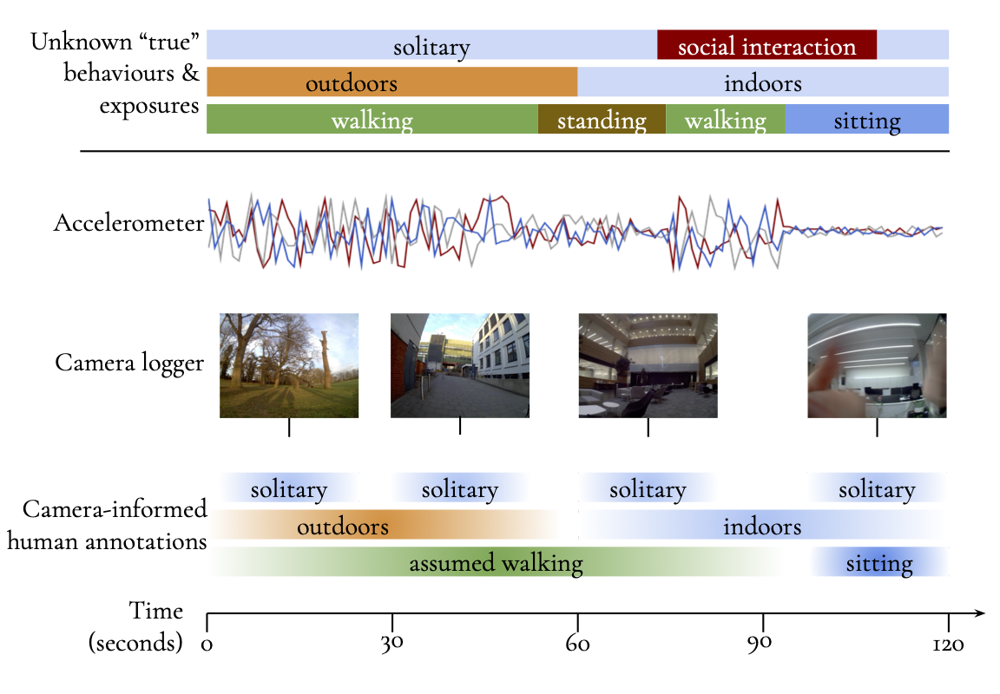

# Wearable sensor data collection and annotation



This repository contains instructions and code for collecting and annotating wearable data. 
```bash
practicals
├── sensor_processing.ipynb # <= processing, visualising, annotating wearables
└── sensor_setup.md # <= setting up wearables
```

To get started, clone this branch of the repository:
```bash
git clone -b RMLWHDS2024 https://github.com/OxWearables/WearableCollectionTutorial.git
```
